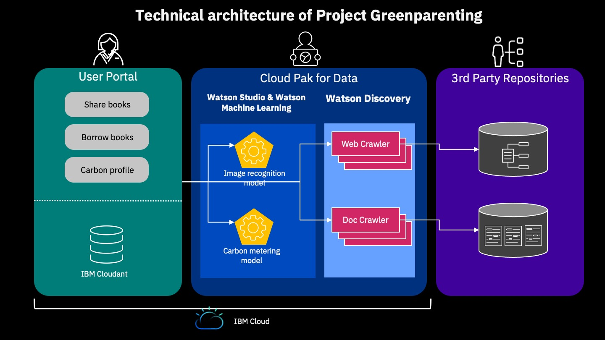

# Project Greenparenting for Call for Code 2021
## Table of content
- Project description
- User scenario
- Project architecture
- License

## Project description
Worldwide consumption and production drives the global economy, yet the current use of natural resources is unsustainable. The global material footprint rose nearly 18 percent from 73 billion metric tons in 2010 to 85.9 billion metric tons in 2017, the UN [reports](https://undocs.org/en/E/2020/57).

Project greenparenting aims to reduce the paper wates and carbon releasing by leveraging technology on building a trust and transparent books sharing platform for parents. This books sharing platform uses AI technology to easy and automate the donation and borrowing process with tracking the carbon footprint and metering to promote the awareness of paper waste and book reuse impaction for environment protection.

## User scenario
**Parents** can donate a book by uploading a picture of the coverpage, and the donated book is automatically put on shelf of the library with book profile searched from website and its carbon footprint.

**Book borrower** can look up interested book from the library and borrow the book with the carbon credit payment.

## Project architecture

## License
© IBM Corporation 2021 for Call for Code 2021. All Rights Reserved. 
